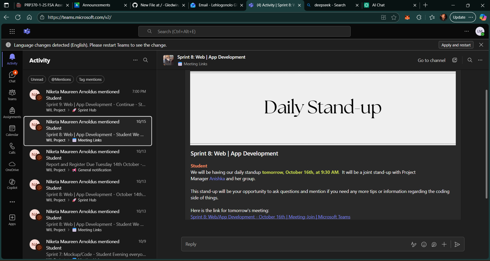
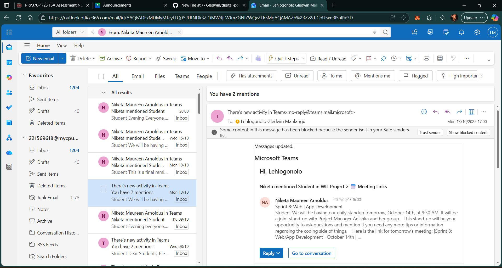

# 🌟 Digital Portfolio – PRP372S (Project Presentation 3)

Student Name: Lehlogonolo Mahlangu  
Student Number: 221569618  
Course Code: PRP372S   
Qualification: Diploma in Information and Communication Technology: Applications Development   
Faculty: Informatics and Design   
Lecturer: P. Inderlal   
Due Date: 18 October 2025   

# Introduction 

This digital portfolio is a reflection of the skills, knowledge, and experiences I have gained during the **Work Readiness Training** program. It includes both **evidence of participation** and **reflections** written using the **STAR Technique** (Situation, Task, Action, Result), aimed at demonstrating my readiness for the professional environment.

The portfolio is organized into the following key sections:
- **Business Communication**
- **Interview Skills**
- **Mock Interview**
- **Professional Networking**
- **Workplace Etiquette**

# Business Communication and Workplace Etiquette

The evidence demostrates my participation in the communication and documentation aspects of the WIL project, which align with the Business Communication and Workplace Etiquette criteria for the digital portfolio.

 

## For the Business Communication

As an individual working on my own business idea and its technical solution, I was responsible for communicating the project's strategy and progress to my supervisors. My task was to clearly articulate the complex details of my concept and regularly report my individual progress to stay on track. To achieve this, I created formal documents, such as the Business Profile and Brand Strategy, which served as the official written communication of my core plan. Additionally, I used the Daily Stand-up to provide concise, professional verbal updates on my progress and any individual challenges. 
This clear, dual-approach communication ensured that all supervisors were aligned with my project goals, allowing me to manage expectations and quickly receive feedback, which helped me efficiently build my tech solution.

Reflection: STAR technique

- Situation - As an individual working on my business idea and technical solution, I was solely responsible for communicating my project's vision, strategy, and progress to the Project Manager and any involved facilitators.

- Task - I needed to clearly articulate the complex details of my business idea (e.g., brand and research) in a professional format, and regularly report my individual progress to ensure I stayed on track.
  
- Action - I created formal, detailed documents, such as the Business Profile and Brand Strategy, which clearly communicated my core strategy in writing. I used the Daily Stand-up to provide concise, professional updates on my individual progress and any personal blockers.
  
- Result - The clear, documented strategy ensured that all supervisors were aligned with my project goals. My effective communication during stand-ups allowed me to manage expectations and quickly get feedback, helping me efficiently build my tech solution.

## For Workplace Etiquestte 

My individual project required me to follow professional protocols, which meant I needed to demonstrate strong professional conduct by being reliable, using official communication channels, and keeping all my documentation highly organized. I ensured I was always on time for the mandatory Daily Stand-up and any scheduled check-ins, showing respect for the administrator's time. For all communication, I exclusively used official platforms like Teams and CPUT email. Furthermore, I maintained a highly organized file system with clear naming for documents like the Research Strategy (artefact). My consistent punctuality and adherence to these channels ensured I did not disrupt the project flow for others, and my overall professional conduct showed I am ready to operate reliably and independently in a supervised, professional environment.

Reflection: STAR technique

- Situation - My individual project required me to follow professional protocols, including timely reporting and proper documentation, as expected in a supervised academic/work setting.
- Task - I needed to demonstrate strong professional conduct by being reliable, using official communication channels, and keeping all my individual project documentation organized 
- Action - I ensured I was always on time for the mandatory Daily Stand-up and any scheduled check-ins. I exclusively used official platforms like Teams and CPUT email for all communication. Furthermore, I maintained an organized file system with clear names for all my documents (artefact), showing respect for the administrator's review time.
- Result - My consistent punctuality and adherence to official channels ensured I did not disrupt the project flow for others. My professional conduct showed I am ready to operate reliably and independently in a supervised, professional environment.

# Interview Skills

The primary evidence for my Interview Skills is the successful completion of the required formative assessments on the learning management system. I achieved a perfect score on both required tasks:

 - Interview Skills Assessment: 100/100

 - 1 Interview Skills - Interview Skills Assessment: 100/100

These scores validate my knowledge of effective interview preparation, response strategies, and professional conduct during the interview process, demonstrating I've mastered the theoretical skills covered in the work readiness training.

Reflection: STAR technique

- Situation
- Task
- Action
- Result

Reflection: STAR technique

- Situation
- Task
- Action
- Result

Reflection: STAR technique

- Situation
- Task
- Action
- Result

Reflection: STAR technique

- Situation
- Task
- Action
- Result

